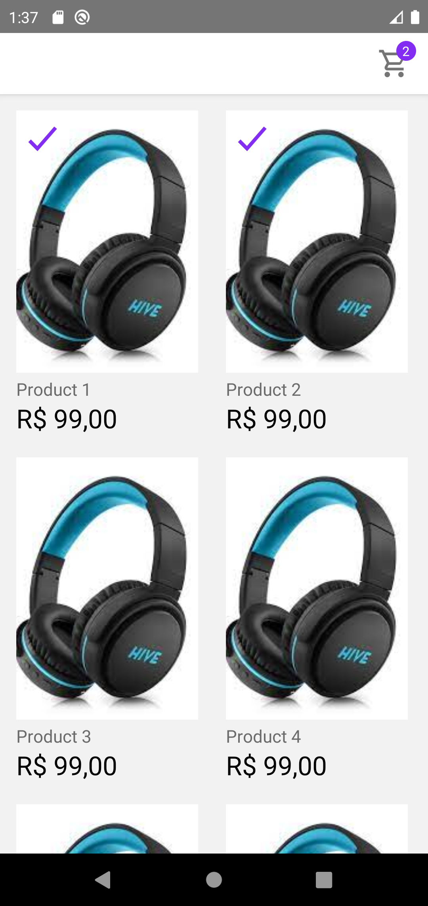
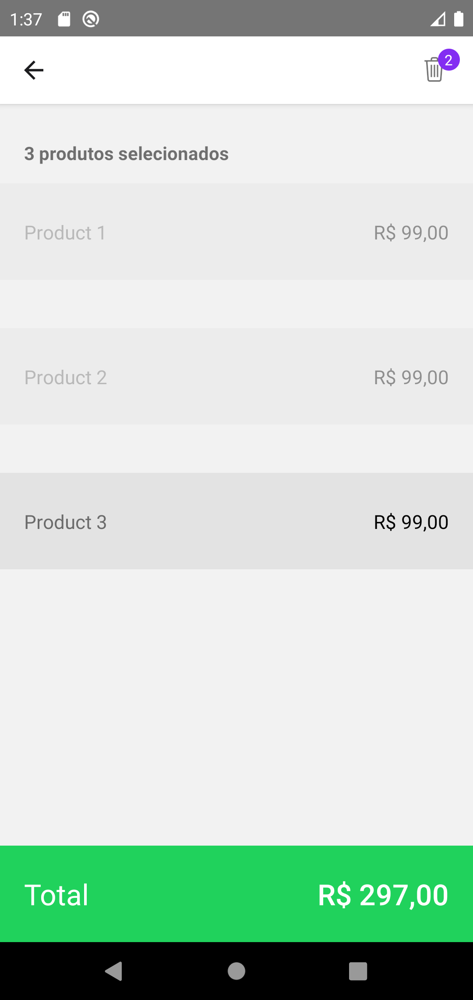
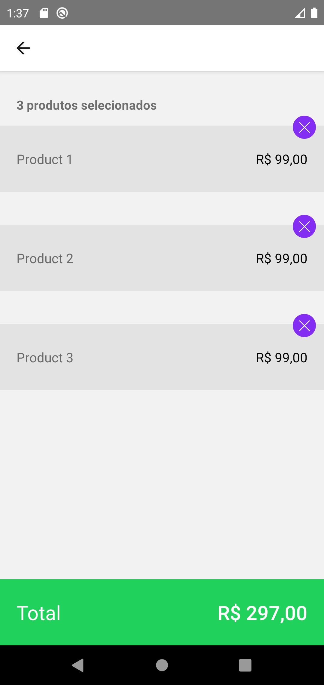

# App do desafio front-end Ton.

App desenvolvido com React Native para listagem de produtos e carrinho.

_Baixe o APK de teste_ [aqui](app-release.apk)

### Features

- Lista de produtos
- Adicionar/remover produtos do carrinho
- Multi seleção para deleção através da callBack `onLongPress`
- Carrinho com produtos selecionados

### Pricipais bibliotecas

- `styled-components`: desenvolvimento de componentes estilizados
- `@react-navigation/native` e `@react-navigation/native-stack`: controle de rotas e navegação do app
- `redux`, `react-redux`: gerenciamento de estado global
- `redux-saga`: controle de requisições assíncronas junto a store do `redux`

### Prints

**1 - Home**

**2 - Carrinho: Multi seleção**

**3 - Carrinho**

